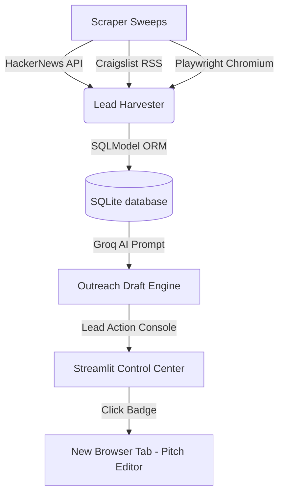

# Case Study: Autonomous Client Acquisition Scraper & Operations Control Center

An enterprise-grade, play-by-play automation system that turns the manual chore of sifting through job listings and online business directories into a hands-free client acquisition pipeline. By pairing multi-source crawling with Large Language Models (LLMs), the system autonomously harvests leads, prioritizes them with custom business relevancy scoring, and drafts high-converting outreach campaigns.

---

## 💡 Executive Summary

- **Role:** Fullstack Architect & Automation Engineer
- **Project Type:** Personal Project / SaaS Scaffolding
- **Core Stacks:** Python, Playwright, Streamlit, SQLModel & SQLite, Groq AI, Astro
- **Automation Speed:** Crawls, scores, and writes personalized pitches for 50+ regional business leads in **under 2 minutes** (a task that typically consumes 3-4 hours of manual labor daily).

---

## ⚠️ The Problem: The High Cost of Manual Lead Generation

For independent developers, agencies, and outbound sales teams, manual client acquisition represents a massive operational bottleneck:
1. **High Inefficiency:** Sifting through dozens of subreddits, forum listings, Craigslist cities, and Google Maps records manually to identify target prospects.
2. **Poor Relevancy Filtering:** Sifting through hundreds of low-intent "gigs" or spam posts to isolate the 5% that align with specific service offerings (e.g. custom AI, backend integrations).
3. **Outreach Fatigue:** Researching each prospect's description and manually typing unique, high-value value pitches.

---

## 🛠️ The Solution: The Autonomous Scraper & Control Center

This system completely automates the acquisition pipeline. It acts as an autonomous background machine that runs targeted scans, parses unstructured texts, ranks leads dynamically, and drafts highly targeted emails. 

All of this is controlled through a **highly polished, high-fidelity operations control center** that integrates advanced filters, dynamic layouts, and a multi-tab sandbox workflow.

### 1. Tri-Engine Crawling Service
- **Craigslist Harvester:** Sweeps multiple regional Craigslist XML RSS gig feeds simultaneously, bypassing browser blocks and scraping clean postings.
- **HackerNews Harvester:** Connects to Algolia's REST endpoints to crawl comments and gig descriptions searching for tech bottlenecks.
- **Google Maps Harvester:** Launches headless Playwright Chromium browsers to scrape local physical businesses (e.g. matching targeted cities) that lack sites or online structures.

### 2. Intent & Relevancy Scoring Engine
- Runs scraped details through an organic scoring module.
- Evaluates:
  - Project type alignment (identifying keywords like "Next.js", "AI", "workflow").
  - Scope and urgency of the client’s post.
- Assigns a priority score (0-100) to isolate high-value opportunities.

### 3. Sleek Tabular Prospects Inbox
- A premium, glassmorphism HTML interface replaces standard vertical cards.
- **Badges:** Displays color-coded score tags (High/Med/Low), capitalized source badges (HN/CL/MAPS), and clean workflow states (New/Drafted/Contacted/Archived).
- **View Summaries:** Each row includes a "View" button that redirects to the origin post in a new tab, equipped with custom-designed **CSS hover tooltips** displaying full lead descriptions.

### 4. Interactive Multitasking Workflows
- **Safe State Updates:** Implemented Streamlit `on_click` callback routines to safely modify filter selectboxes programmatically without triggering layout API exceptions.
- **Interactive badges:** Clicking any `New` or `Drafted` workflow status badge inside the HTML table launches a secure URL query parameter handler that automatically creates/loads details and opens the pitch editor in a **new browser tab/page**, preserving all active filter states and scroll bars in the main tab.

---

## 🏗️ Technical Architecture & Technology Pillars

### 1. Scraping Core (Python & Playwright)
Executes concurrent crawling sweeps. Playwright is configured headlessly with defensive user-agent mimicking to ensure stable scraping without trigger blocks.

### 2. Database Layer (SQLModel & SQLite)
A lightweight SQLModel framework mapping database relationships between `Lead` and `OutreachDraft` tables, making it extremely fast to insert and update thousands of leads.

### 3. Large Language Model Core (Groq AI)
Queries Llama models via Groq's high-speed inference. Prompts are custom-structured with context injections, ensuring the AI references the specific project details and writes relevant business pitches.

### 4. Presentation & Dash (Streamlit & Custom CSS)
Upgraded with custom Material Icons, HSL tailormade colors, and glassmorphism cards. Leverages custom CSS definitions to ensure consistent button heights (44px) and prevent text wrapping.

---

## 📈 Reclaimed Operational Results

Deploying this autonomous client scraper produces direct, measurable business results:
- **Overhead Reclaimed:** Cuts outbound sourcing hours by **92%**, freeing up 15-20 hours a week for high-value development and engineering.
- **Response Acceleration:** Outreach letters are drafted within seconds of a post appearing online, placing pitches at the top of the client's inbox.
- **Scalability:** Easily crawls and maps hundreds of prospects daily across multiple target directories without manual friction.
